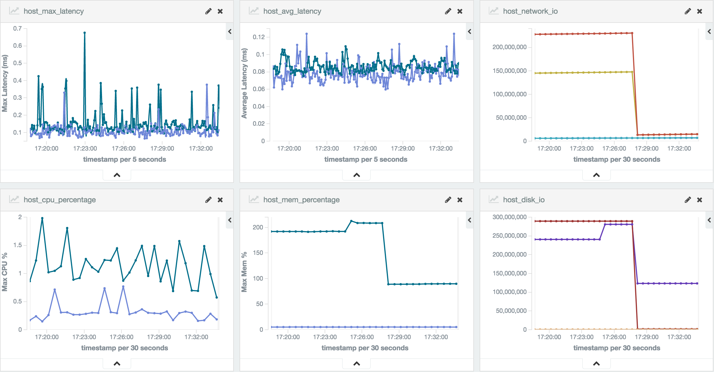
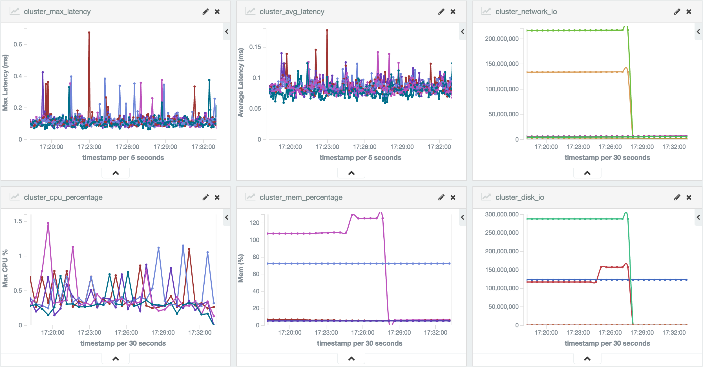

cmonit
===

Monitor for container stats, etc.

cmonit can automatically read host info from db, and check the containers (with `label=monitor=true`) status, and then write back to db.

Example visualized results:




## Usage

### Run in container
```sh
$ docker run \
 --rm yeasy/cmonit \
 start --output-elasticsearch-url="192.168.7.60:9200"
```

### Local build
```sh
$ make run
```
## Configuration
cmonit will automatically search the `cmonit.yaml` file under `.`, `$HOME`, `/etc/cmonit/` or `$GOPATH/github.com/yeasy/cmonit`.

Please see [cmonit.yaml](cmonit.yaml) for example.

A typical config file will look like
```yaml
logging:
  level: debug
input:
  url: "mongo:27017"    //mongo db url
  db_name: "dev"           //name of the db to use
  col_host: "host"      //from which collection to get host info
  col_cluster: "cluster_active"
output:
  mongo:
    url: "mongo:27017"
    db_name: "monitor"//store data to which collection
    col_host: "host"  # stat data for each host with timestamp
    col_cluster: "cluster"  # stat data for each cluster with timestamp
    col_container: "container"  # stat data for each cluster with timestamp
  elasticsearch:  # to support in future
    url: "elasticsearch:9200"
    index: "monitor"
sync:
  interval: 60          //sync host info interval, in seconds
monitor:
  expire: 7             //monitor data expiration, in days
  interval: 5          //monitor container info interval, in seconds
```


## TODO
* ~~Update the config file to support more functionality.~~
* ~~Re-arch to use db and collect data more efficiently.~~
* ~~May support es as output too.~~
* ~~When db crash, should continue to work with warning msg.~~
* ~~Reduce connections and optimize the performance.~~
